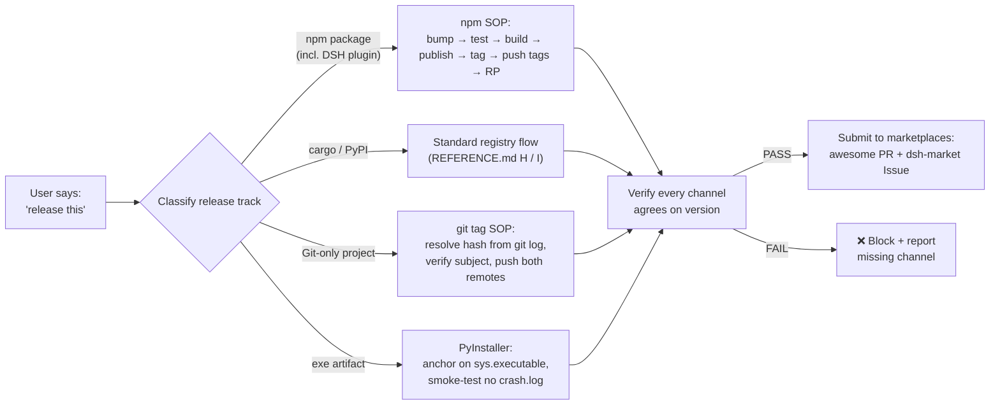

# 🚀 publish-kit — Release Playbook for AI Agents

<p align="center">
  
  
  
  
  
</p>

> **One release prompt, every channel aligned.** A directory-bundle Agent Skill that turns "release this" into a coordinated publish across npm registries, GitHub + Gitee remotes, marketplace listings, repo RP fields, bilingual README, and git tags — all in lockstep.
> Zero npm publish required to use it. Works on DSH, Claude Code, Codex CLI, Gemini CLI, Cursor.

<p align="center"><strong>⭐ If you ship software and have ever lost a version to "I forgot to tag it,"</strong> give it a Star.
<br/><sub>One command: <code>npx skills add https://github.com/EternalNight996/publish-kit</code></sub></p>

---

## 🔥 The pain: a release touches every silo, and any one slipping breaks the chain

| # | Pain (everyone who ships hits these) | What it costs |
|---|---|---|
| 1 | **Forgot the git tag** | npm knows v0.4.27 but git has no anchor; `git checkout v<x.y.z>` returns 404; release history becomes guesswork from commit messages |
| 2 | **Changed code, forgot to bump version** | `npm publish` returns 403 (cannot publish over); for DSH plugins the marketplace validator silently rejects; changelog drifts behind reality |
| 3 | **Pushed to GitHub only, forgot Gitee** | half your users see a broken README image, the other half get "404 not found" on the install command |
| 4 | **Shipped to one marketplace, missed the other three** | the DSH ecosystem has 4+ marketplaces (awesome-dsh-plugin, dsh-market, dsh-marketplace, dsh-plugin-marketplace); publishing to one and not the others means 75% of potential users never see your work |
| 5 | **Wrote the token into `.npmrc` and committed it** | one careless `git add -A` and your npm publish token is on a public GitHub forever — every bot in the world knows it within minutes |

> This is not paranoia; every one of these happened in real releases documented in `EXAMPLES.md`.

---

## 🚀 After loading the skill: each pain solved with one prompt

| Pain | After publish-kit handles it | How |
|---|---|---|
| ① Forgot the tag | every release creates `v<x.y.z>` anchored to the version-bump commit, verified before push | `git show v<x.y.z> --format=%s` gate before `--tags` |
| ② 403 on republish | version bump is the first step in every SOP; `npm view <pkg> version` checked before publishing | script enforces it (see `scripts/bootstrap-release.{ps1,sh}`) |
| ③ Gitee drift | one-liner dual-remote push with SSH; force-reset stale remote URLs | `publish.bat` template + bash equivalent |
| ④ Missed marketplaces | pre-flight checklist covers all 4 DSH channels (PR + Issue + topic + metadata) | REFERENCE.md section B matrix + TEMPLATE.md A-C |
| ⑤ Leaked token | throwaway `.npmrc.publish` is deleted in the same script's `finally` | token never lives longer than one command |



---

## 🧬 Core design: why a Skill bundle, not an npm package

The publish-kit skill is **not** a cordis plugin and **not** an npm runtime dependency. It is a directory of dense facts + copy-paste templates that the agent consults when you ask it to release something. Three design decisions follow from that:

| Decision | What | Why |
|---|---|---|
| **No npm publish required** | the skill ships at GitHub + Gitee; install is `npx skills add <url>` | matches every host that reads directory-bundle skills (DSH, Claude Code, Codex, Gemini) without forcing a registry dependency |
| **Templated, not opinionated** | ten copy-paste templates, one per release track (DSH plugin, awesome yml, dsh-market Issue, publish.bat, bilingual README, PUBLISH.md, GitHub Actions, Cargo.toml, pyproject.toml, PyInstaller) | each template is annotated with "when to use" + "knobs to inspect"; no single track dominates |
| **Honest about source** | sections A-G and J come from 11 hands-on release memory cards (npm, DSH plugins, GitHub/Gitee, PyInstaller); sections H-I (cargo, PyPI) state the standard registry flow without claiming local battle-testing | you know which advice is hard-won vs baseline |

> **publish-kit complements rather than competes with the release tooling the agent already knows.** It encodes specific release traps (`npm pack --dry-run` for files whitelist, `git show` for tag verification, full-width punctuation in `.bat`, the `_MEIPASS` PyInstaller path) that generic release helpers skip.

| Existing tooling | What it covers | Where publish-kit fills in |
|---|---|---|
| `dev-agent-skills` (fvadicamo) | git/GitHub workflow + skill authoring | release-specific knowledge: marketplace matrix, slimming, semver traps |
| `pr-workflow` (ALSEL) | PR review + merge workflow | the publish step *after* PR merge: tag, both remotes, marketplace, RP fields |
| `skill-multi-publisher` (LobeHub) | publishing skill *files* to a marketplace | release knowledge for the package/plugin *the skill describes*, not the skill itself |
| `commit-history` / `commit-context` (DSH) | tracing which session wrote which commit | nothing about the release boundary (tag, version, marketplace) |

> If you already use any of the above, publish-kit adds the layer they skip — the **release boundary** itself.

---

## ✨ Feature tour

<details>
<summary><b>📦 SKILL.md (under 100 lines, model-invoked)</b></summary>

- Frontmatter `name` + `description` carrying the concrete trigger branches (publish, release, deploy, ship, bump version, cut tag, write README, slim npm package, cargo publish, PyPI, PyInstaller, GitHub Releases, marketplace submission).
- Quick start, workflow, anti-patterns, checklist, See also — the agent reads this first when the trigger fires.

</details>

<details>
<summary><b>📚 REFERENCE.md (dense facts, sections A-J)</b></summary>

- **A. npm release SOP** — version bump → test → publish → tag → push → RP, with registry, token, scope, files whitelist, peer-dependency traps.
- **B. DSH plugin marketplace matrix** — 4 channels (awesome-dsh-plugin, dsh-market, dsh-marketplace, dsh-plugin-marketplace) with mechanism + manual step + checkpoint.
- **C. npm details** — peerDependencies semver, pnpm workspace, npx version lock, host restart semantics.
- **D. npm slimming** — files whitelist vs .gitignore; showcase media via raw.githubusercontent; runtime assets keep in the tarball; ffmpeg GIF compression.
- **E. git tag SOP** — resolve hash from `git log`, verify subject, push; never guess with `commit~N`.
- **F. Bilingual README** — file split, badge row, GIF under 10 MB.
- **G. Dual-remote GitHub + Gitee** — SSH, one-shot `publish.bat`, full-width punctuation trap.
- **H. cargo / crates.io** — standard flow (honestly noted: not yet battle-tested locally).
- **I. PyPI / PyInstaller** — `_MEIPASS` path trap, `base_library.zip` stale-cache trap, ASCII-punctuation bat trap.
- **J. Pitfall quick table** — 9-row symptom → fix reference.

</details>

<details>
<summary><b>📝 TEMPLATE.md (10 copy-paste skeletons)</b></summary>

Every template is annotated with **when to use** + **knobs to inspect before publishing**. Tracks covered: DSH plugin `package.json`, awesome-dsh-plugin yml entry, dsh-market Issue body, dual-remote `publish.bat`, bilingual README skeleton, git-install `PUBLISH.md`, GitHub Actions release workflow, `Cargo.toml`, `pyproject.toml`, PyInstaller build script.

</details>

<details>
<summary><b>🔧 scripts/bootstrap-release.{ps1,sh}</b></summary>

Six-step automation that runs the entire SOP end-to-end:

```bash
./scripts/bootstrap-release.sh patch    # or minor / major
```

Bump version → test → build → commit → npm publish (with throwaway `.npmrc.publish` deleted in `finally`) → tag + push both remotes → GitHub RP fields. Pass `patch`, `minor`, or `major` as the argument.

</details>

<details>
<summary><b>📥 INSTALL.md / DSH-DEPLOY.md / COMPATIBILITY.md / EXAMPLES.md</b></summary>

- **INSTALL.md** — 4 install paths (Vercel `npx skills add`, DSH native, `dsh-agent-skills` mirror, manual curl).
- **DSH-DEPLOY.md** — DSH-specific: six discovery roots, watch semantics, rank ordering, distribution channels, topic taxonomy.
- **COMPATIBILITY.md** — platform matrix for DSH / Claude Code / Codex / Gemini / Cursor / Windsurf / Copilot, frontmatter field support, body-format limits.
- **EXAMPLES.md** — worked transcripts: this skill's own v0.1.0 release (18 steps) + full DSH plugin npm flow + 7-row pitfall reference.

</details>

---

## 🚀 Install (one command)

```bash
npx skills add https://github.com/EternalNight996/publish-kit
```

Installs into `~/.agents/skills/` on every host that reads directory-bundle skills (DSH, Claude Code, Codex CLI, Gemini CLI, Cursor). Install only this skill:

```bash
npx skills add https://github.com/EternalNight996/publish-kit --skill "publish-kit"
```

Project-scoped (committable):

```bash
git clone https://github.com/EternalNight996/publish-kit .agents/skills/publish-kit
```

Manual copy (no `npx` or `git`, e.g. corporate proxies):

```powershell
# PowerShell
mkdir $env:USERPROFILE\.agents\skills\publish-kit
curl -L https://raw.githubusercontent.com/EternalNight996/publish-kit/main/.agents/skills/publish-kit/SKILL.md -o $env:USERPROFILE\.agents\skills\publish-kit\SKILL.md
# repeat for REFERENCE.md / TEMPLATE.md / INSTALL.md / DSH-DEPLOY.md / COMPATIBILITY.md / EXAMPLES.md
```

> **Note on npm:** publish-kit ships at GitHub + Gitee as a skill bundle; it is **not published to npm**. The npm wrapper pattern (for users who want `dsh plugin --profile web add publish-kit`) is documented in `DSH-DEPLOY.md` and `TEMPLATE.md` section A as an opt-in — no code in the bundle assumes it.

---

## 🔧 Bundle layout

```
publish-kit/
├── README.md              # this file (English)
├── README.zh.md           # Chinese mirror
├── LICENSE                # MIT
├── CHANGELOG.md           # Keep a Changelog
├── .gitignore
├── .claude-plugin/
│   ├── plugin.json        # Vercel CLI manifest
│   └── marketplace.json   # Vercel CLI marketplace
└── .agents/skills/publish-kit/
    ├── SKILL.md           # main entry, <100 lines, model-invoked
    ├── REFERENCE.md       # dense facts (sections A-J)
    ├── TEMPLATE.md        # 10 copy-paste skeletons
    ├── INSTALL.md         # 4 install paths
    ├── DSH-DEPLOY.md      # DSH-specific deployment
    ├── COMPATIBILITY.md   # platform + frontmatter matrix
    └── EXAMPLES.md        # worked transcripts
```

---

## 🗺 Roadmap

**v0.1.0 (current):** initial bundle — SKILL.md / REFERENCE.md / TEMPLATE.md / INSTALL.md / DSH-DEPLOY.md / COMPATIBILITY.md / scripts/bootstrap-release.{ps1,sh}.

**v0.1.1 (current):** added EXAMPLES.md with two worked transcripts (this release + a fictional DSH plugin npm flow).

**Coming soon:**
- [ ] `release-doctor.mjs` — pre-flight checker that scans a target repo for the 9-row pitfall table in REFERENCE.md J and reports drift before publish
- [ ] `verify-release.mjs` — post-publish verifier that walks every channel (npm view, gh release, gitee release, awesome-dsh-plugin search, dsh-market issue status, GitHub topics, marketplace catalog) and reports per-channel status
- [ ] npm wrapper package (`@eternalnight/publish-kit-plugin`) — ships `skills/publish-kit/` as an asset, hooks a `prepare` script to symlink into `~/.agents/skills/`, exposed via `dsh plugin --profile web add`
- [ ] Multi-language templates — add Rust `Cargo.lock` strategy, Python `setup.cfg` legacy path, GitLab CI / Gitea Actions release workflows

---

## 📦 Release log

- **v0.1.1** (2026-08-28): bootstrap-release scripts (ps1 + sh); EXAMPLES.md worked transcripts; SKILL.md See also extended; README script reference added.
- **v0.1.0** (2026-08-28): initial bundle — 6-document skill, 10 templates, 4 install paths, full DSH deployment guide. PR #3554 to awesome-dsh-plugin (category=skill); Issue #94 to dsh-market.

> See [CHANGELOG.md](./CHANGELOG.md) for the Keep a Changelog-style record.

---

## 🔌 Discovery / Distribution

The GitHub repo carries the topics that auto-discovery scanners read. Listing them makes the bundle findable through every supported channel.

| Channel | Mechanism | Status |
|---|---|---|
| `npx skills add <repo-url>` | Vercel CLI reads `.claude-plugin/plugin.json` | ✅ |
| **awesome-dsh-plugin** | PR adding `data/plugins/EternalNight996__publish-kit.yml` | ✅ PR #3554 |
| **dsh-market** (2BingLing) | Issue submission | ✅ Issue #94 |
| **dsh-marketplace** (ouyangyipeng) | reads `dsh-skill` topic | ✅ topic set |
| **dsh-find-plugin** | searches by topic | ✅ |
| **dsh-plugin-marketplace** (YELEBAI) | reads topic + `dsh.marketplace` metadata | n/a (skill bundle, not plugin) |

GitHub repo topics set:

```
agent-skills · cargo · dsh-skill · npm · publishing · pypi · release
```

---

## 📜 License

MIT

---

> **Ship once, ship in agreement.** ⭐ If you've ever debugged "why is Gitee 4 versions behind," give it a Star.
