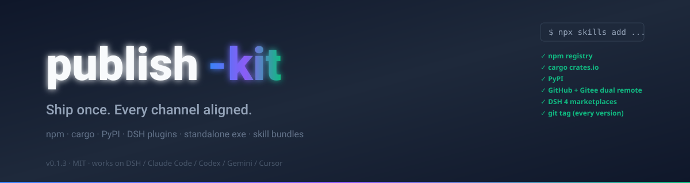
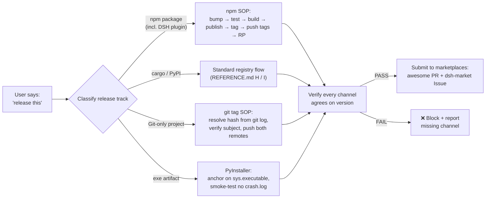

# 🚀 publish-kit — Release Playbook for AI Agents

<p align="center">
  
</p>

<p align="center">
  
  
  
  
  
  
  
  
</p>

> **One release prompt, every channel aligned.** A directory-bundle Agent Skill + npm-installable CLI that turns "release this" into a coordinated publish across npm registries, GitHub + Gitee remotes, marketplace listings, repo RP fields, bilingual README, and git tags — all in lockstep.
> Works on DSH, Claude Code, Codex CLI, Gemini CLI, Cursor. Runs anywhere Node, Python, Rust, Go, or any exe target lives.

<p align="center">
  <strong>English</strong> · <a href="./README.zh.md">简体中文</a>
</p>

<p align="center"><strong>⭐ If you ship software and have ever lost a version to "I forgot to tag it,"</strong> give it a Star.
<br/><sub>Install: <code>npx skills add https://github.com/EternalNight996/publish-kit</code> or <code>npm i -g @eternalnight/publish-kit</code></sub></p>

---

## 🚀 Install

Three install paths, all one command. Pick the one that matches your host.:

```bash
# Skill bundle (any agent that reads .agents/skills/ — DSH, Claude Code, Codex, Gemini, Cursor)
npx skills add https://github.com/EternalNight996/publish-kit

# npm package (global CLI: bootstrap-release + release-exe available on PATH)
npm install -g @eternalnight/publish-kit

# DSH plugin via npm wrapper (uses the package's dsh.marketplace metadata)
dsh plugin --profile web add @eternalnight/publish-kit
```

For project-scoped (committable) installs and `dsh-agent-skills` UI integration, see [INSTALL.md](./.agents/skills/publish-kit/INSTALL.md).

---

## 📖 Usage

### As an Agent Skill (model-invoked)

Once loaded, the agent responds to any of these prompts automatically:

```text
release this                       cut v0.4.2
publish my new version             ship it
bump version and tag               submit to marketplace
write the README                   slim the npm package
cargo publish this                 publish to PyPI
tag this commit                    push to GitHub and Gitee
build the exe and upload to GitHub Releases
```

The skill classifies the request into one of 8 release tracks (npm / DSH plugin / cargo / PyPI / PyInstaller exe / Go binary / Rust binary / Electron desktop), runs the per-track steps, and verifies every channel agrees on the version before declaring the release done. Full workflow in [SKILL.md](./.agents/skills/publish-kit/SKILL.md).

### As a CLI (manual invocation)

After `npm install -g @eternalnight/publish-kit`, two commands are available:

```bash
# npm package release (six-step SOP: bump + publish + tag + push + RP)
bootstrap-release patch    # or minor | major

# exe release (PyInstaller / Go / Rust / Electron cross-platform build + GitHub Release)
release-exe rust mycli 1.0.0 "x86_64-unknown-linux-gnu,x86_64-pc-windows-msvc,x86_64-apple-darwin"
```

Both scripts take an optional `-Draft` / `--draft` flag to publish a draft release for review first.

---

## 🤖 Supported agents & languages (at a glance)

### Agents that consume publish-kit

| Agent | How install lands | Status |
| --- | --- | --- |
| **DeepSeek Harness (DSH)** | `<root>/.agents/skills/publish-kit/` (built-in skill-filesystem) | ✅ native |
| **Claude Code** | `~/.claude/skills/publish-kit/` | ✅ native |
| **Codex CLI** | `~/.codex/skills/publish-kit/` | ✅ native |
| **Gemini CLI** | `~/.gemini/skills/publish-kit/` | ✅ native |
| **Cursor** | `<root>/.cursor/skills/publish-kit/` (partial; some builds scan `.agents/skills/`) | ⚠ best-effort |
| **Windsurf** | `<root>/.windsurf/skills/` | ⚠ best-effort |
| **OpenCode** | `~/.config/opencode/skills/` | ✅ via dsh-agent-skills plugin |
| **VS Code Copilot** | `.github/copilot-instructions.md` (partial coverage) | ⚠ partial |

### Programming languages & package ecosystems publish-kit ships templates for

| Language / ecosystem | Template | Registry / store |
| --- | --- | --- |
| **JavaScript / TypeScript** | TEMPLATE.md A (DSH plugin) + D (npm) | npmjs.org |
| **Rust** | TEMPLATE.md H (`Cargo.toml`) + K.3 (GitHub Actions) | crates.io + GitHub Releases |
| **Python (package)** | TEMPLATE.md I (`pyproject.toml`) | pypi.org + GitHub Releases |
| **Python (standalone exe)** | TEMPLATE.md J (PyInstaller) + K.1 (GitHub Actions) | GitHub Releases |
| **Go** | K.2 (GitHub Actions cross-compile matrix) | GitHub Releases |
| **Electron / Tauri** | K.4 (electron-builder) | GitHub Releases |
| **Homebrew** (macOS) | README instructions | homebrew-core / personal tap |
| **Scoop** (Windows) | README instructions | main / personal bucket |
| **Chocolatey** (Windows) | README instructions | chocolatey.org |
| **Docker** | README instructions + K series | Docker Hub + GHCR |
| **Maven Central / JCenter** (Java / Kotlin) | README instructions | search.maven.org |
| **NuGet** (.NET) | README instructions | nuget.org |
| **RubyGems** (Ruby) | README instructions | rubygems.org |

Every non-DSH track follows the same SOP: bump version → tests + build → publish → git tag → push tags to both remotes → marketplace submission (where applicable) → RP fields.

---

| # | Pain (everyone who ships hits these) | What it costs |
|---|---|---|
| 1 | **Forgot the git tag** | npm knows v0.4.27 but git has no anchor; `git checkout v<x.y.z>` returns 404; release history becomes guesswork from commit messages |
| 2 | **Changed code, forgot to bump version** | `npm publish` returns 403 (cannot publish over); for DSH plugins the marketplace validator silently rejects; changelog drifts behind reality |
| 3 | **Pushed to GitHub only, forgot Gitee** | half your users see a broken README image, the other half get "404 not found" on the install command |
| 4 | **Shipped to one marketplace, missed the other three** | the DSH ecosystem has 4+ marketplaces (awesome-dsh-plugin, dsh-market, dsh-marketplace, dsh-plugin-marketplace); publishing to one and not the others means 75% of potential users never see your work |
| 5 | **Wrote the token into `.npmrc` and committed it** | one careless `git add -A` and your npm publish token is on a public GitHub forever — every bot in the world knows it within minutes |

> This is not paranoia; every one of these happened in real releases documented in `EXAMPLES.md`.

---

## 🚀 After loading the skill: each pain solved with one prompt

| Pain | After publish-kit handles it | How |
|---|---|---|
| ① Forgot the tag | every release creates `v<x.y.z>` anchored to the version-bump commit, verified before push | `git show v<x.y.z> --format=%s` gate before `--tags` |
| ② 403 on republish | version bump is the first step in every SOP; `npm view <pkg> version` checked before publishing | script enforces it (see `scripts/bootstrap-release.{ps1,sh}`) |
| ③ Gitee drift | one-liner dual-remote push with SSH; force-reset stale remote URLs | `publish.bat` template + bash equivalent |
| ④ Missed marketplaces | pre-flight checklist covers all 4 DSH channels (PR + Issue + topic + metadata) | REFERENCE.md section B matrix + TEMPLATE.md A-C |
| ⑤ Leaked token | throwaway `.npmrc.publish` is deleted in the same script's `finally` | token never lives longer than one command |



---

## 🧬 Core design: why a Skill bundle, not an npm package

The publish-kit skill is **not** a cordis plugin and **not** an npm runtime dependency. It is a directory of dense facts + copy-paste templates that the agent consults when you ask it to release something. Three design decisions follow from that:

| Decision | What | Why |
|---|---|---|
| **No npm publish required** | the skill ships at GitHub + Gitee; install is `npx skills add <url>` | matches every host that reads directory-bundle skills (DSH, Claude Code, Codex, Gemini) without forcing a registry dependency |
| **Templated, not opinionated** | ten copy-paste templates, one per release track (DSH plugin, awesome yml, dsh-market Issue, publish.bat, bilingual README, PUBLISH.md, GitHub Actions, Cargo.toml, pyproject.toml, PyInstaller) | each template is annotated with "when to use" + "knobs to inspect"; no single track dominates |
| **Honest about source** | sections A-G and J come from 11 hands-on release memory cards (npm, DSH plugins, GitHub/Gitee, PyInstaller); sections H-I (cargo, PyPI) state the standard registry flow without claiming local battle-testing | you know which advice is hard-won vs baseline |

> **publish-kit complements rather than competes with the release tooling the agent already knows.** It encodes specific release traps (`npm pack --dry-run` for files whitelist, `git show` for tag verification, full-width punctuation in `.bat`, the `_MEIPASS` PyInstaller path) that generic release helpers skip.

| Existing tooling | What it covers | Where publish-kit fills in |
|---|---|---|
| `dev-agent-skills` (fvadicamo) | git/GitHub workflow + skill authoring | release-specific knowledge: marketplace matrix, slimming, semver traps |
| `pr-workflow` (ALSEL) | PR review + merge workflow | the publish step *after* PR merge: tag, both remotes, marketplace, RP fields |
| `skill-multi-publisher` (LobeHub) | publishing skill *files* to a marketplace | release knowledge for the package/plugin *the skill describes*, not the skill itself |
| `commit-history` / `commit-context` (DSH) | tracing which session wrote which commit | nothing about the release boundary (tag, version, marketplace) |

> If you already use any of the above, publish-kit adds the layer they skip — the **release boundary** itself.

---

## ✨ Feature tour

<details>
<summary><b>📦 SKILL.md (under 100 lines, model-invoked)</b></summary>

- Frontmatter `name` + `description` carrying the concrete trigger branches (publish, release, deploy, ship, bump version, cut tag, write README, slim npm package, cargo publish, PyPI, PyInstaller, GitHub Releases, marketplace submission).
- Quick start, workflow, anti-patterns, checklist, See also — the agent reads this first when the trigger fires.

</details>

<details>
<summary><b>📚 REFERENCE.md (dense facts, sections A-J)</b></summary>

- **A. npm release SOP** — version bump → test → publish → tag → push → RP, with registry, token, scope, files whitelist, peer-dependency traps.
- **B. DSH plugin marketplace matrix** — 4 channels (awesome-dsh-plugin, dsh-market, dsh-marketplace, dsh-plugin-marketplace) with mechanism + manual step + checkpoint.
- **C. npm details** — peerDependencies semver, pnpm workspace, npx version lock, host restart semantics.
- **D. npm slimming** — files whitelist vs .gitignore; showcase media via raw.githubusercontent; runtime assets keep in the tarball; ffmpeg GIF compression.
- **E. git tag SOP** — resolve hash from `git log`, verify subject, push; never guess with `commit~N`.
- **F. Bilingual README** — file split, badge row, GIF under 10 MB.
- **G. Dual-remote GitHub + Gitee** — SSH, one-shot `publish.bat`, full-width punctuation trap.
- **H. cargo / crates.io** — standard flow (honestly noted: not yet battle-tested locally).
- **I. PyPI / PyInstaller** — `_MEIPASS` path trap, `base_library.zip` stale-cache trap, ASCII-punctuation bat trap.
- **J. Pitfall quick table** — 9-row symptom → fix reference.

</details>

<details>
<summary><b>📝 TEMPLATE.md (10 copy-paste skeletons)</b></summary>

Every template is annotated with **when to use** + **knobs to inspect before publishing**. Tracks covered: DSH plugin `package.json`, awesome-dsh-plugin yml entry, dsh-market Issue body, dual-remote `publish.bat`, bilingual README skeleton, git-install `PUBLISH.md`, GitHub Actions release workflow, `Cargo.toml`, `pyproject.toml`, PyInstaller build script.

</details>

<details>
<summary><b>🔧 scripts/bootstrap-release.{ps1,sh}</b></summary>

Six-step automation that runs the entire SOP end-to-end:

```bash
./scripts/bootstrap-release.sh patch    # or minor / major
```

Bump version → test → build → commit → npm publish (with throwaway `.npmrc.publish` deleted in `finally`) → tag + push both remotes → GitHub RP fields. Pass `patch`, `minor`, or `major` as the argument.

</details>

<details>
<summary><b>📥 INSTALL.md / DSH-DEPLOY.md / COMPATIBILITY.md / EXAMPLES.md</b></summary>

- **INSTALL.md** — 4 install paths (Vercel `npx skills add`, DSH native, `dsh-agent-skills` mirror, manual curl).
- **DSH-DEPLOY.md** — DSH-specific: six discovery roots, watch semantics, rank ordering, distribution channels, topic taxonomy.
- **COMPATIBILITY.md** — platform matrix for DSH / Claude Code / Codex / Gemini / Cursor / Windsurf / Copilot, frontmatter field support, body-format limits.
- **EXAMPLES.md** — worked transcripts: this skill's own v0.1.0 release (18 steps) + full DSH plugin npm flow + 7-row pitfall reference.

</details>

---

## 🌐 Detailed packaging ecosystem table

The tables below expand on the "at a glance" view above; each track's "where it lives" column names the registry or store the release lands in.

### DSH ecosystem (native)

| Track | What ships | Where it lives |
| --- | --- | --- |
| **DSH cordis plugin** | `package.json` + `cordis.patch.yml` + `lib/client.js` | npm registry + 4 DSH marketplaces + GitHub + Gitee |
| **DSH skill bundle** (this repo) | `SKILL.md` + companion `.md` files in a directory | GitHub + Gitee + `~/.agents/skills/` (no npm) |
| **DSH plugin shipped via npm wrapper** | npm package wrapping `skills/publish-kit/` as an asset | npm + DSH `dsh plugin` install path |
| **DSH theme asset** | `assets/{backgrounds,themes}/` runtime URLs kept in npm tarball; showcase media moved to GitHub raw | npm + GitHub + Gitee |

### Non-DSH language libraries (host-agnostic)

| Track | What ships | Where it lives |
| --- | --- | --- |
| **npm / JavaScript / TypeScript** | `package.json` + `dist/` (or `lib/`) | npmjs.org + GitHub + Gitee |
| **cargo / Rust** | `Cargo.toml` + `src/` (published as immutable versions) | crates.io + GitHub + Gitee |
| **PyPI / Python** | `pyproject.toml` + `<pkg>/` | pypi.org + GitHub + Gitee |
| **PyInstaller exe** (Windows / macOS / Linux) | standalone executable with `sys.executable`-anchored output paths | GitHub Releases + Gitee Releases |
| **Homebrew formula** (macOS) | `<formula>.rb` | homebrew-core PR or personal tap |
| **Scoop bucket** (Windows) | `<bucket>/<pkg>.json` | main bucket PR or personal bucket |
| **Chocolatey package** (Windows) | `<pkg>.nuspec` + `tools/*.ps1` | chocolatey.org moderation queue |
| **Go module** | `go.mod` + versioned git tag (no separate registry; modules are tag-resolved) | GitHub + Gitee only |
| **Docker image** | multi-stage `Dockerfile` (linux/amd64, linux/arm64) | Docker Hub + GHCR + Gitee Go Registry |
| **Maven Central / JCenter** (Java / Kotlin) | `pom.xml` + sources jar + GPG-signed artifacts | search.maven.org + GitHub + Gitee |
| **NuGet** (.NET) | `.nuspec` + `.nupkg` | nuget.org + GitHub + Gitee |
| **RubyGems** (Ruby) | `<gem>.gemspec` | rubygems.org + GitHub + Gitee |

Every non-DSH track goes through the same SOP: bump version → tests + build → publish → git tag → push tags to both remotes → marketplace submission (where applicable) → RP fields.

### Tracks publish-kit explicitly does NOT cover

- Monorepo versioning strategy (`lerna`/`changesets`/`nx release`) — see `find-skills` for monorepo-specific tooling.
- Language-specific lint/test setup (separate skill per language).
- Host runtime debugging (DSH plugin loader errors, npm peer resolution diagnostics).
- Release internals design (package API surface, library architecture).

---

## 📚 Skill bundle discovery & inclusion standards

For publish-kit-style bundles to surface on every host that consumes them, the bundle must satisfy the conventions below. This section is both **the standard publish-kit itself follows** and **the checklist you should apply to your own skill bundle**.

### Universal requirements (every host)

| Requirement | Why |
| --- | --- |
| Directory layout: `<bundle>/SKILL.md` (+ optional sibling `.md` files) | All hosts scan a folder containing `SKILL.md` as the unit |
| `SKILL.md` frontmatter `name` + `description` (model-invoked) | Both required for catalog discovery |
| `description` includes a "Use when ..." sentence with concrete trigger branches | One trigger per branch; synonyms collapsed |
| `name` is kebab-case, lowercase | All hosts enforce |
| `SKILL.md` body <100 lines | House convention (DEEP);
| Dense facts live in `REFERENCE.md`; templates in `TEMPLATE.md`; install in `INSTALL.md` | Progressive disclosure so the agent only loads what it needs |
| `LICENSE` (MIT recommended) + `CHANGELOG.md` at repo root | Trust signal for both humans and auto-discovery |
| Repo is **public** | All hosts require public |

### DSH marketplace inclusion matrix

| Marketplace | Mechanism | Manual step | Required artifact |
| --- | --- | --- | --- |
| `npx skills add <repo-url>` | Vercel CLI reads `.claude-plugin/plugin.json` | none for the user | `.claude-plugin/plugin.json` + `.claude-plugin/marketplace.json` |
| **awesome-dsh-plugin** | PR | yes | `data/plugins/<owner>__<repo>.yml` with `category: skill`; `node scripts/generate-readme.mjs` afterward |
| **dsh-market** (2BingLing) | Issue | yes | title `[提交工具] <name>`; reference topic `dsh-skill` |
| **dsh-marketplace** (ouyangyipeng) | auto-scan by topic | none | repo topic `dsh-skill` (or `dsh-plugin` for cordis plugins) |
| **dsh-find-plugin** | search by topic | none | topic `dsh-skill` (or `dsh-plugin`) |
| **dsh-plugin-marketplace** (YELEBAI) | auto-scan every 2h, static validate | none | topic + `package.json#dsh.marketplace` metadata (cordis plugins only) |
| `dsh-agent-skills` plugin (DSH settings UI) | scans 5 directories | none | dropped into `~/.agents/skills/`, `~/.claude/skills/`, `~/.codex/skills/`, `~/.gemini/skills/`, or `~/.config/opencode/skills/` |

### GitHub repo RP (required for marketplace auto-scanners)

```bash
# Description (one-line, English; keywords help SEO)
gh api -X PATCH repos/<owner>/<repo> -f description="<one-line>"

# Topics (independent endpoint — DO NOT include topics in the PATCH above, it returns 400)
gh api -X PUT repos/<owner>/<repo>/topics --input topics.json
# topics.json content: {"names":["dsh-skill","agent-skills","publishing","release","npm","cargo","pypi"]}
```

### Topic taxonomy

| Domain | Required topics | Optional |
| --- | --- | --- |
| Skill bundle | `dsh-skill`, `agent-skills` | `publishing`, `release`, domain-specific (e.g. `npm`, `cargo`) |
| Cordis plugin | `dsh-plugin`, `deepseek-harness` | `theme`, `memory`, `tooling`, etc. |
| Both | both sets | `awesome-dsh-plugin` |

### GitHub social preview

Upload `assets/social-preview.png` (1280×640 PNG) at **Settings → General → Social preview**. This is the image GitHub, Gitee, npm, and Twitter use when the URL is shared — a strong preview is the single largest click-rate lever. See the next section for design guidance.

### For skill authors (publishing your own bundle)

1. Use this repo (`publish-kit`) as the template — copy `.agents/skills/<your-skill>/` and the supporting top-level files.
2. Add the topics your bundle needs (don't add `dsh-skill` if you're shipping a cordis plugin only).
3. Open one PR against `awesome-dsh-plugin` and one Issue against `dsh-market`.
4. Run the skill's own SOP once on yourself before publishing (eat your own dogfood — proves the templates work).

---

## 🎨 README & repo home: how to maximize clicks

The biggest leverage point for a new release is the **first 5 seconds** a visitor spends on the GitHub repo home. This section codifies the moves publish-kit itself uses; copy them for your own bundles.

### Repo home (the GitHub repo landing page)

| Element | What to do | Why |
| --- | --- | --- |
| **Social preview image** | Upload `assets/social-preview.png` (1280×640) at Settings → General | Single largest click-rate lever when the URL is shared on social, in npm search, in PRs |
| **Description** | One line, English, with concrete keywords (not "awesome X framework" but "release playbook covering npm/cargo/PyPI + DSH marketplaces") | Scans show in search results; vague descriptions get passed over |
| **Topics** | 5-10 topics, all relevant | Sidebar filter + marketplace auto-discovery both depend on topics |
| **Pinned repos** | Pin 2-3 most-used skills or sister repos | Signals to visitors that this is part of an ecosystem, not a one-off |
| **About sidebar** | Website, Releases link (if using GitHub Releases), Packages link (if shipping npm), Projects (if using project boards) | Each link is a chance to retain the visitor |

### README structure (the visited page)

| Section | Why it matters |
| --- | --- |
| **Banner image** (top, full-width) | Visual hook; lets the visitor decide "is this for me?" in 1 second |
| **One-line tagline + badge row** | Tells the visitor what + what language/registry before they scroll |
| **Pain table** (3-5 rows) | Visitors self-identify with concrete pains; generic "for everyone" copy skips everyone |
| **Before/After mapping** | Shows you've understood their problem AND have a specific answer |
| **Mermaid (or static-table) flow** | Proves the system has a structure, not just a slogan |
| **"Why X, not Y" core design section** | Differentiates from look-alikes; people buy when they see you've made deliberate tradeoffs |
| **Comparison table to alternatives** | Visitors want to know "why not just use [alternative]?" — answer before they ask |
| **Install in the first 30 lines** | If the install command is below the fold, you lose 50%+ of would-be users |
| **Roadmap** | Signals the project is alive; lets visitors vote with issues |
| **Release log (or link to CHANGELOG.md)** | Trust signal — "this project has shipped"|
| **License + contributing link** | Removes friction for the next step (use, contribute, fork) |

### Asset hygiene that wins clicks

- **Banner at the top.** Full-width PNG or WebP (GitHub README rendering prefers `assets/readme-banner.{svg,png,webp}` referenced as relative `./assets/...`).
- **GIFs under 10 MB.** Compress with ffmpeg (REFERENCE.md D6). Over the threshold, GitHub silently drops the image.
- **Use `raw.githubusercontent.com` URLs for any image rendered on GitHub AND npm AND Gitee.** Keeps images in git (so both git hosts render them) but out of the npm tarball.
- **Mermaid with a static-table fallback.** Some hosts (older Cursor, Windsurf, Copilot) don't render Mermaid; provide a parallel table for those viewers.
- **Pin a screenshot or GIF showing the result**, not the install command. Visitors want to see the outcome, then decide.

### SEO & shareability

- Repo Description: one line, English, with at least 2 keywords that search engines and humans both use (e.g. "release playbook for AI agents npm cargo PyPI").
- Topics: never duplicate the description; think of them as tags, not keywords. Aim for 5-10.
- README H1 should match the repo name. GitHub renders H1 as the page title.
- Social preview must show the project name + one-line tagline + version. A wall of text in social preview kills click-through.

### Community signals that move the needle

- **Star CTA in the README** — one line near the top, not aggressive.
- **"Used by" section** if any real project depends on this — concrete social proof.
- **A pinned Discussion / Q&A category** at repo Settings → Features — invites questions, builds community.
- **An explicit License** — MIT for maximum reach. Missing license = legal ambiguity = lost users.
- **Sponsor button** at `.github/FUNDING.yml` — optional but signals sustainability.

publish-kit itself follows every line above; the README you are reading is the example.

## 🔧 Bundle layout

```
publish-kit/
├── README.md              # this file (English)
├── README.zh.md           # Chinese mirror
├── LICENSE                # MIT
├── CHANGELOG.md           # Keep a Changelog
├── .gitignore
├── .claude-plugin/
│   ├── plugin.json        # Vercel CLI manifest
│   └── marketplace.json   # Vercel CLI marketplace
└── .agents/skills/publish-kit/
    ├── SKILL.md           # main entry, <100 lines, model-invoked
    ├── REFERENCE.md       # dense facts (sections A-J)
    ├── TEMPLATE.md        # 10 copy-paste skeletons
    ├── INSTALL.md         # 4 install paths
    ├── DSH-DEPLOY.md      # DSH-specific deployment
    ├── COMPATIBILITY.md   # platform + frontmatter matrix
    └── EXAMPLES.md        # worked transcripts
```

---

## 🧪 Pre-release strategy (ship a beta, then promote)

For any non-trivial change, publish a pre-release first, validate, then promote to `latest`. A bug in `latest` hits 100% of `npm install <pkg>` users; a bug in `beta` only hits opt-in testers.

```bash
# Step 1: pre-release (npm `beta` dist-tag + GitHub Pre-release)
./scripts/bootstrap-release.sh patch --pre-release beta
# -> v0.4.1-beta.1

# Step 2: iterate on beta if bugs surface
./scripts/bootstrap-release.sh --pre-release beta --pre-release-bump 2
# -> v0.4.1-beta.2

# Step 3: promote to latest (no version bump; only moves dist-tag)
./scripts/bootstrap-release.sh --promote-from-beta --promote-version v0.4.1-beta.2
# -> v0.4.1 published to npm `latest` + GitHub Production release
```

| Version | npm dist-tag | GitHub Release flag | Use for |
| --- | --- | --- | --- |
| `0.4.1-beta.1` | `beta` | Pre-release | first external test pass |
| `0.4.1-beta.2` | `beta` | Pre-release | after fixing beta.1 bugs |
| `0.4.1-rc.1` | `rc` | Pre-release | release-candidate (feature-frozen) |
| `0.4.1` | `latest` | Production | promoted from rc.1 |

**Skip pre-release for**: doc-only changes (README typo, comment cleanup), patch releases with no behavior change. Full SOP + recovery playbook in [REFERENCE.md section K](./.agents/skills/publish-kit/REFERENCE.md).

---

## 🗺 Roadmap

**v0.1.0 (current):** initial bundle — SKILL.md / REFERENCE.md / TEMPLATE.md / INSTALL.md / DSH-DEPLOY.md / COMPATIBILITY.md / scripts/bootstrap-release.{ps1,sh}.

**v0.1.1 (current):** added EXAMPLES.md with two worked transcripts (this release + a fictional DSH plugin npm flow).

**v0.1.5 (current):** added `scripts/release-exe.{ps1,sh}` for exe projects (PyInstaller / Go / Rust / Electron cross-platform builds + checksum + GitHub Release upload); TEMPLATE.md K section with 4 GitHub Actions workflows (K.1 PyInstaller / K.2 Go matrix / K.3 Rust matrix / K.4 Electron); EXAMPLES.md Example 3 (Rust CLI end-to-end transcript + 7-row pitfall table); README EN/ZH language toggle buttons.

**v0.2.0 (current):** **npm package `@eternalnight/publish-kit`** published to https://registry.npmjs.org/ — 19 files / 51 KB / scoped / MIT / explicit registry / signed. Bundles the skill directory, ships scripts as `bin`, includes `cordis.patch.yml` + `dsh.marketplace` metadata for `dsh plugin` install path. README top-of-page Install + Usage + Supported agents/languages tables. All "not published to npm" notes updated to reflect the publication.

**v0.2.1 (current):** docs cleanup — removed duplicate old Install section in both READMEs; marked npm wrapper Roadmap entry as completed (superseded by v0.2.0 publication).

**v0.3.0 (current):** repo governance — `.github/ISSUE_TEMPLATE/{bug_report,feature_request,release_question}.yml`, `.github/PULL_REQUEST_TEMPLATE.md`, `.github/CONTRIBUTING.md`, `.github/SECURITY.md`, `.github/CODE_OF_CONDUCT.md`, `.github/FUNDING.yml`; CI workflow (`.github/workflows/ci.yml`, 4 jobs: validate-skill / check-readme-links / check-package / check-markdown-toc); `assets/social-preview.png` (1280x640).

**v0.5.0-beta.1 (current):** **Pre-release workflow** — REFERENCE.md K section + bootstrap-release.{ps1,sh} with `--pre-release beta` / `--promote-from-beta` flags; release-exe.{ps1,sh} with `-Prerelease` flag; release-doctor prerelease check; verify-release dist-tag channel; SKILL.md Workflow step 2 + README EN/ZH Pre-release strategy section; **npm `@eternalnight/publish-kit@0.5.0-beta.1` on dist-tag=`beta`**; git tag `v0.5.0-beta.1` on GitHub + Gitee; GitHub Release marked Pre-release.

**v0.4.0:** scripts — `release-doctor.mjs` (12 pre-flight checks for git / npm / DSH marketplace / lockfile / docs / remotes / GH RP / .bat), `verify-release.mjs` (9-channel post-publish verifier), `scripts/README.md` (usage docs); `.github/dependabot.yml` (weekly GitHub Actions + npm + Docker auto-PR); repo settings (`delete_branch_on_merge`, `allow_update_branch`, Discussions); GitHub Releases for v0.2.0 / v0.2.1 / v0.3.0 / v0.4.0; PR #3554 conflicts resolved (now `MERGEABLE`); **Gitee mirror complete** (`https://gitee.com/eternalnight996/publish-kit` has main + 9 tags); **npm `@eternalnight/publish-kit@0.4.0` published** (20 files / 56.6 KB / signed).

**Coming soon:**
- [ ] `release-doctor.mjs` — pre-flight checker that scans a target repo for the 9-row pitfall table in REFERENCE.md J and reports drift before publish
- [ ] `verify-release.mjs` — post-publish verifier that walks every channel (npm view, gh release, gitee release, awesome-dsh-plugin search, dsh-market issue status, GitHub topics, marketplace catalog) and reports per-channel status
- [x] npm wrapper package (`@eternalnight/publish-kit`) — ships `skills/publish-kit/` as an asset, symlinks into `~/.agents/skills/` via `postinstall`, exposed via `dsh plugin --profile web add` (v0.2.0)
- [ ] Multi-language templates — add Rust `Cargo.lock` strategy, Python `setup.cfg` legacy path, GitLab CI / Gitea Actions release workflows

---

## 📦 Release log

- **v0.5.0-beta.1** (2026-08-29): pre-release workflow (REFERENCE.md K + bootstrap-release prerelease/promote flags + release-exe prerelease flag + release-doctor + verify-release dist-tag check + SKILL + README EN/ZH). npm `@eternalnight/publish-kit@0.5.0-beta.1` on dist-tag=`beta`. GitHub Pre-release.
- **v0.4.0** (2026-08-28): `release-doctor.mjs` (12 pre-flight checks) + `verify-release.mjs` (9-channel post-publish verifier) + `scripts/README.md`; `.github/dependabot.yml`; repo settings (delete_branch_on_merge + Discussions); PR #3554 conflicts resolved; **Gitee mirror complete**; **npm `@eternalnight/publish-kit@0.4.0` published**.
- **v0.3.0** (2026-08-28): repo governance — issue templates (bug/feature/question), PR template, CONTRIBUTING, SECURITY, CODE_OF_CONDUCT, FUNDING; CI workflow (4 jobs); social-preview.png (1280x640).
- **v0.2.1** (2026-08-28): docs cleanup — removed duplicate Install section in both languages; marked npm wrapper Roadmap item as completed.
- **v0.2.0** (2026-08-28): npm package `@eternalnight/publish-kit` published (51 KB, 19 files, signed); top-of-page Install + Usage + Supported agents/languages tables; README/DSH-DEPLOY/CHANGELOG npm-publication notes synchronized.
- **v0.1.5** (2026-08-28): `scripts/release-exe.{ps1,sh}` (PyInstaller / Go / Rust / Electron build + checksum + GitHub Release); TEMPLATE.md K section (4 GitHub Actions workflows); EXAMPLES.md Example 3 (Rust CLI transcript); README EN/ZH language toggle.
- **v0.1.4** (2026-08-28): EN/ZH language toggle buttons at the top of both READMEs.
- **v0.1.3** (2026-08-28): language support matrix (DSH + 12 non-DSH libraries); skill bundle inclusion matrix; README/homepage attractiveness guide; banner SVG.
- **v0.1.2** (2026-08-28): README rewritten following dsh-memory-eternal productization pattern; npm status clarified; bilingual README.zh.md.
- **v0.1.1** (2026-08-28): bootstrap-release scripts (ps1 + sh); EXAMPLES.md worked transcripts; SKILL.md See also extended; README script reference added.
- **v0.1.0** (2026-08-28): initial bundle — 6-document skill, 10 templates, 4 install paths, full DSH deployment guide. PR #3554 to awesome-dsh-plugin (category=skill); Issue #94 to dsh-market.

> See [CHANGELOG.md](./CHANGELOG.md) for the Keep a Changelog-style record.

---

## 🔌 Discovery / Distribution

The GitHub repo carries the topics that auto-discovery scanners read. Listing them makes the bundle findable through every supported channel.

| Channel | Mechanism | Status |
|---|---|---|
| `npx skills add <repo-url>` | Vercel CLI reads `.claude-plugin/plugin.json` | ✅ |
| **awesome-dsh-plugin** | PR adding `data/plugins/EternalNight996__publish-kit.yml` | ✅ PR #3554 |
| **dsh-market** (2BingLing) | Issue submission | ✅ Issue #94 |
| **dsh-marketplace** (ouyangyipeng) | reads `dsh-skill` topic | ✅ topic set |
| **dsh-find-plugin** | searches by topic | ✅ |
| **dsh-plugin-marketplace** (YELEBAI) | reads topic + `dsh.marketplace` metadata | n/a (skill bundle, not plugin) |

GitHub repo topics set:

```
agent-skills · cargo · dsh-skill · npm · publishing · pypi · release
```

---

## 📜 License

MIT

---

> **Ship once, ship in agreement.** ⭐ If you've ever debugged "why is Gitee 4 versions behind," give it a Star.
