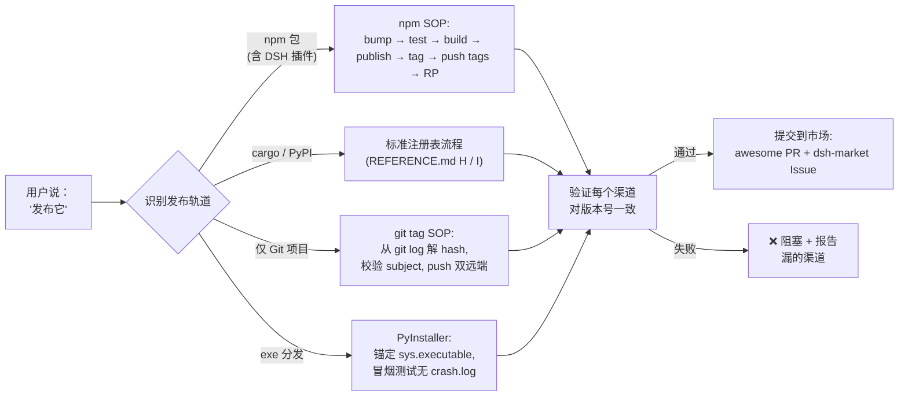

# 🚀 publish-kit — 面向 AI Agent 的发布工具箱

<p align="center">
  
  
  
  
  
</p>

> **一句「发布它」就让每个渠道都对齐。** 这是一个目录式 Agent Skill，把发布动作拆成跨 npm 注册表、GitHub + Gitee 双远端、市场收录、双语 README、git tag 等所有渠道的协调动作——一次发布，全程一致。
> **使用它本身不需要 npm 发布。** 兼容 DSH / Claude Code / Codex CLI / Gemini CLI / Cursor。

<p align="center"><strong>⭐ 如果你发过包又曾因「忘了打 tag」而丢了版本，</strong> 给个 Star。
<br/><sub>一条命令：<code>npx skills add https://github.com/EternalNight996/publish-kit</code></sub></p>

---

## 🔥 先看痛点：发布涉及多个渠道，任何一个掉链子都翻车

| # | 痛点（每个发过包的人都遇到过） | 代价 |
|---|---|---|
| 1 | **忘了打 git tag** | npm 知道 v0.4.27 但 git 没有锚点；`git checkout v<x.y.z>` 返回 404；发版历史只能从 commit message 猜 |
| 2 | **改了代码忘了升版本号** | `npm publish` 返 403（无法重发）；DSH 插件会被市场静默拒绝；changelog 永远落后于现实 |
| 3 | **只推了 GitHub 忘了 Gitee** | 一半用户看到裂图，另一半看到安装命令 404 |
| 4 | **只投了一个市场，漏了其他三个** | DSH 生态有 4+ 个市场（awesome-dsh-plugin、dsh-market、dsh-marketplace、dsh-plugin-marketplace）；只投一个 = 75% 潜在用户看不到 |
| 5 | **把 token 写进 .npmrc 提交了** | 一次 `git add -A` 不小心，token 就永久公开放到 GitHub，全球所有 bot 几分钟内拿到 |

> 这不是危言耸听；`EXAMPLES.md` 里每一条都有真实记录。

---

## 🚀 装上技能之后：每个痛点一句话解决

| 痛点 | 装上 publish-kit 之后 | 怎么做到的 |
|---|---|---|
| ① 忘了打 tag | 每次发布都在版本号 commit 上打 `v<x.y.z>`，push 前先 `git show` 校验 | 校验在 push 之前 |
| ② 403 重发失败 | bump 版本是每条 SOP 的第一步；publish 前先 `npm view <pkg> version` 检查 | 脚本强制（`scripts/bootstrap-release.{ps1,sh}`）|
| ③ Gitee 漂移 | 一行双远端 push，SSH 协议；强制重置过期 remote URL | `publish.bat` 模版 + bash 等价物 |
| ④ 漏市场 | 起飞前清单覆盖全部 4 个 DSH 渠道（PR + Issue + topic + 元数据）| REFERENCE.md B 节矩阵 + TEMPLATE.md A-C |
| ⑤ token 泄漏 | 一次性 `.npmrc.publish` 在同一脚本的 `finally` 中删除 | token 寿命不超过一条命令 |



---

## 🧬 核心设计：为什么是 Skill bundle 而不是 npm 包

publish-kit **不是** cordis 插件，**也不是** npm 运行时依赖。它是一个「密集事实 + 可复制模版」的目录，Agent 在你说「发布」时调阅。三个设计决策由此而来：

| 决策 | 是什么 | 为什么 |
|---|---|---|
| **不强制 npm 发布** | 技能只在 GitHub + Gitee 跑；安装是 `npx skills add <url>` | 匹配所有读目录式 skill 的宿主（DSH、Claude Code、Codex、Gemini），不强制依赖注册表 |
| **模版化、不持立场** | 10 个可复制模版，每个轨道一个（DSH 插件 / awesome yml / dsh-market Issue / publish.bat / 双语 README / PUBLISH.md / GitHub Actions / Cargo.toml / pyproject.toml / PyInstaller） | 每个模版都标注「何时用」+「检查什么旋钮」；不偏向任何一个 |
| | **诚实标注来源** | A-G 和 J 节来自 11 张实战发布记忆卡（npm、DSH 插件、GitHub/Gitee、PyInstaller）；H-I 节（cargo、PyPI）只写标准流程，未声称本地实战 | 你能区分哪些是硬碰硬来的、哪些是基线 |

> **publish-kit 与 Agent 已知的发版工具互补而非竞争。** 它把通用发版助手跳过的具体陷阱编码进去（`npm pack --dry-run` 看 files 白名单、`git show` 校验 tag、`.bat` 全角标点、PyInstaller `_MEIPASS` 路径）。

| 已有工具 | 覆盖范围 | publish-kit 补的位 |
|---|---|---|
| `dev-agent-skills` (fvadicamo) | git/GitHub 工作流 + 技能创作 | 发版专属知识：市场矩阵、瘦身、semver 陷阱 |
| `pr-workflow` (ALSEL) | PR 评审 + 合入工作流 | PR 合入后的发版动作：tag、双远端、市场、RP 字段 |
| `skill-multi-publisher` (LobeHub) | 把 skill 文件发布到市场 | 给「skill 描述的包/插件」做发布，不是发布 skill 本身 |
| `commit-history` / `commit-context` (DSH) | 追溯哪个 session 写了哪个 commit | 不管发布边界（tag、版本、市场） |

> 你已经在用任何一个？publish-kit 补的就是它们跳过的那一层——**发布边界**本身。

---

## ✨ 功能总览

<details>
<summary><b>📦 SKILL.md（<100 行，模型触发）</b></summary>

- frontmatter `name` + `description` 携带具体触发分支（publish、release、deploy、ship、bump version、cut tag、write README、slim npm package、cargo publish、PyPI、PyInstaller、GitHub Releases、marketplace submission）。
- Quick start / workflow / anti-patterns / checklist / See also——Agent 在触发时先读它。

</details>

<details>
<summary><b>📚 REFERENCE.md（密集事实，A-J 节）</b></summary>

- **A. npm 发版 SOP** — 升版本 → test → publish → tag → push → RP，含 registry、token、scope、files 白名单、peer 依赖陷阱。
- **B. DSH 插件市场矩阵** — 4 个渠道（awesome-dsh-plugin、dsh-market、dsh-marketplace、dsh-plugin-marketplace），每个含机制 + 手动步骤 + 检查点。
- **C. npm 细节** — peerDependencies semver、pnpm workspace、npx 锁版本、host 重启语义。
- **D. npm 瘦身** — files 白名单 vs .gitignore；展示素材走 raw.githubusercontent；运行时资产保留在 tarball；ffmpeg GIF 压缩。
- **E. git tag SOP** — 从 `git log` 解 hash、校验 subject、push；绝不用 `commit~N` 猜。
- **F. 双语 README** — 分文件、badge 行、GIF <10MB。
- **G. GitHub + Gitee 双远端** — SSH、一键 `publish.bat`、全角标点陷阱。
- **H. cargo / crates.io** — 标准流程（诚实标注：本地尚未实战验证）。
- **I. PyPI / PyInstaller** — `_MEIPASS` 路径陷阱、`base_library.zip` 缓存陷阱、bat ASCII 标点陷阱。
- **J. 坑位速查表** — 9 行症状→修复。

</details>

<details>
<summary><b>📝 TEMPLATE.md（10 个可复制骨架）</b></summary>

每个模版都标注 **何时用** + **发版前看什么旋钮**。覆盖轨道：DSH 插件 `package.json`、awesome-dsh-plugin yml 条目、dsh-market Issue body、双远端 `publish.bat`、双语 README 骨架、git 安装 `PUBLISH.md`、GitHub Actions release workflow、`Cargo.toml`、`pyproject.toml`、PyInstaller 构建脚本。

</details>

<details>
<summary><b>🔧 scripts/bootstrap-release.{ps1,sh}</b></summary>

端到端六步自动化：

```bash
./scripts/bootstrap-release.sh patch    # 或 minor / major
```

bump 版本 → test → build → commit → npm publish（一次性 `.npmrc.publish` 在 `finally` 删除） → tag + push 双远端 → GitHub RP 字段。参数：patch / minor / major。

</details>

<details>
<summary><b>📥 INSTALL.md / DSH-DEPLOY.md / COMPATIBILITY.md / EXAMPLES.md</b></summary>

- **INSTALL.md** — 4 种安装方式（Vercel `npx skills add`、DSH 原生、`dsh-agent-skills` 镜像、手动 curl）。
- **DSH-DEPLOY.md** — DSH 专项：6 个发现路径、watch 语义、rank 排序、分发渠道、topic 分类。
- **COMPATIBILITY.md** — 平台矩阵（DSH / Claude Code / Codex / Gemini / Cursor / Windsurf / Copilot）+ frontmatter 字段消费表 + body 格式约束。
- **EXAMPLES.md** — 实战 transcript：本技能自身的 v0.1.0 发布（18 步）+ 完整 DSH 插件 npm 流程 + 7 行坑位速查。

</details>

---

## 🚀 安装（一条命令）

```bash
npx skills add https://github.com/EternalNight996/publish-kit
```

装到所有读目录式 skill 的宿主的 `~/.agents/skills/`（DSH、Claude Code、Codex CLI、Gemini CLI、Cursor）。只装这一个技能：

```bash
npx skills add https://github.com/EternalNight996/publish-kit --skill "publish-kit"
```

项目级（可提交）：

```bash
git clone https://github.com/EternalNight996/publish-kit .agents/skills/publish-kit
```

手动复制（无 npx 或 git，如公司代理）：

```powershell
# PowerShell
mkdir $env:USERPROFILE\.agents\skills\publish-kit
curl -L https://raw.githubusercontent.com/EternalNight996/publish-kit/main/.agents/skills/publish-kit/SKILL.md -o $env:USERPROFILE\.agents\skills\publish-kit\SKILL.md
# REFERENCE.md / TEMPLATE.md / INSTALL.md / DSH-DEPLOY.md / COMPATIBILITY.md / EXAMPLES.md 同上
```

> **关于 npm：publish-kit 在 GitHub + Gitee 以 skill bundle 形式发布，**没有上 npm**。** 想给 DSH 用户一个 `dsh plugin --profile web add publish-kit` 路径的，可选 npm wrapper 模式（见 `DSH-DEPLOY.md` 与 `TEMPLATE.md` A 节）——bundle 里没有任何代码假设这种存在。

---

## 🔧 Bundle 结构

```
publish-kit/
├── README.md              # 本文件（英文）
├── README.zh.md           # 中文镜像
├── LICENSE                # MIT
├── CHANGELOG.md           # Keep a Changelog
├── .gitignore
├── .claude-plugin/
│   ├── plugin.json        # Vercel CLI 清单
│   └── marketplace.json   # Vercel CLI 市场
└── .agents/skills/publish-kit/
    ├── SKILL.md           # 主入口，<100 行，模型触发
    ├── REFERENCE.md       # 密集事实（A-J 节）
    ├── TEMPLATE.md        # 10 个可复制骨架
    ├── INSTALL.md         # 4 种安装方式
    ├── DSH-DEPLOY.md      # DSH 专项部署
    ├── COMPATIBILITY.md   # 平台 + frontmatter 矩阵
    └── EXAMPLES.md        # 实战 transcript
```

---

## 🗺 Roadmap

**v0.1.0（当前）：** 首发 bundle——SKILL.md / REFERENCE.md / TEMPLATE.md / INSTALL.md / DSH-DEPLOY.md / COMPATIBILITY.md / scripts/bootstrap-release.{ps1,sh}。

**v0.1.1（当前）：** 加 EXAMPLES.md 含两个实战 transcript（本发布 + 一个虚构 DSH 插件 npm 流程）。

**即将推出：**
- [ ] `release-doctor.mjs` — 起飞前检查器，扫描目标仓库对照 REFERENCE.md J 的 9 行坑位表，发布前报漂移
- [ ] `verify-release.mjs` — 发布后验证器，走每个渠道（npm view、gh release、gitee release、awesome-dsh-plugin 搜索、dsh-market Issue 状态、GitHub topics、市场目录）并报每渠道状态
- [ ] npm wrapper 包（`@eternalnight/publish-kit-plugin`）—— 把 `skills/publish-kit/` 打成 npm 资产，`prepare` 钩子链接到 `~/.agents/skills/`，通过 `dsh plugin --profile web add` 安装
- [ ] 多语言模版 —— 加 Rust `Cargo.lock` 策略、Python `setup.cfg` 旧路径、GitLab CI / Gitea Actions release workflow

---

## 📦 发布记录

- **v0.1.1** (2026-08-28)：bootstrap-release 脚本（ps1 + sh）；EXAMPLES.md 实战 transcript；SKILL.md See also 扩展；README 脚本引用。
- **v0.1.0** (2026-08-28)：首发 bundle——6 文档技能 + 10 模版 + 4 安装路径 + 完整 DSH 部署指南。已给 awesome-dsh-plugin 发 PR #3554（category=skill）；已给 dsh-market 发 Issue #94。

> 完整 Keep a Changelog 风格记录见 [CHANGELOG.md](./CHANGELOG.md)。

---

## 🔌 发现 / 分发

GitHub 仓库带自动发现扫描器读的所有 topic。打到这些 topic 后，bundle 在所有支持的渠道都可见。

| 渠道 | 机制 | 状态 |
|---|---|---|
| `npx skills add <repo-url>` | Vercel CLI 读 `.claude-plugin/plugin.json` | ✅ |
| **awesome-dsh-plugin** | PR 加 `data/plugins/EternalNight996__publish-kit.yml` | ✅ PR #3554 |
| **dsh-market** (2BingLing) | Issue 提交 | ✅ Issue #94 |
| **dsh-marketplace** (ouyangyipeng) | 读 `dsh-skill` topic | ✅ topic 已打 |
| **dsh-find-plugin** | 按 topic 搜索 | ✅ |
| **dsh-plugin-marketplace** (YELEBAI) | 读 topic + `dsh.marketplace` 元数据 | n/a（skill bundle 非 plugin） |

GitHub 仓库 topic：

```
agent-skills · cargo · dsh-skill · npm · publishing · pypi · release
```

---

## 📜 License

MIT

---

> **一次发布，全程一致。** ⭐ 如果你曾调试过「为什么 Gitee 落后 4 个版本」，给个 Star。
