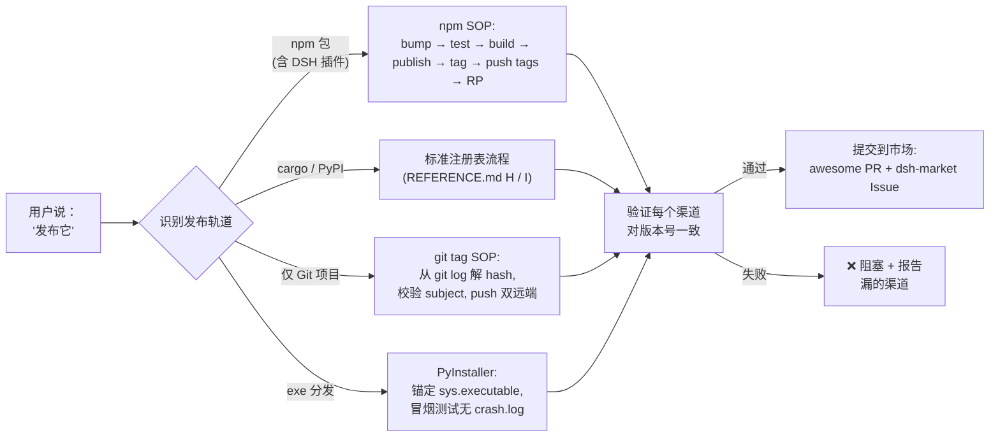

# 🚀 publish-kit — 面向 AI Agent 的发布工具箱

<p align="center">
  
</p>

<p align="center">
  
  
  
  
  
  
  
  
  
</p>

> **一句「发布它」就让每个渠道都对齐。** 这是一个目录式 Agent Skill + 可 npm 安装的 CLI，把发布动作拆成跨 npm 注册表、GitHub + Gitee 双远端、市场收录、双语 README、git tag 等所有渠道的协调动作——一次发布，全程一致。
> 兼容 DSH / Claude Code / Codex CLI / Gemini CLI / Cursor。任何 Node / Python / Go / Rust / exe 工程都能跑。

<p align="center">
  <a href="./README.md">English</a> · <strong>简体中文</strong>
</p>

<p align="center"><strong>⭐ 如果你发过包又曾因「忘了打 tag」而丢了版本，</strong> 给个 Star。
<br/><sub>安装：<code>npx skills add https://github.com/EternalNight996/publish-kit</code> 或 <code>npm i -g @eternalnight/publish-kit</code></sub></p>

---

## 🔥 先看痛点：发布涉及多个渠道，任何一个掉链子都翻车

| # | 痛点（每个发过包的人都遇到过） | 代价 |
|---|---|---|
| 1 | **忘了打 git tag** | npm 知道 v0.4.27 但 git 没有锚点；`git checkout v<x.y.z>` 返回 404；发版历史只能从 commit message 猜 |
| 2 | **改了代码忘了升版本号** | `npm publish` 返 403（无法重发）；DSH 插件会被市场静默拒绝；changelog 永远落后于现实 |
| 3 | **只推了 GitHub 忘了 Gitee** | 一半用户看到裂图，另一半看到安装命令 404 |
| 4 | **只投了一个市场，漏了其他三个** | DSH 生态有 4+ 个市场（awesome-dsh-plugin、dsh-market、dsh-marketplace、dsh-plugin-marketplace）；只投一个 = 75% 潜在用户看不到 |
| 5 | **把 token 写进 .npmrc 提交了** | 一次 `git add -A` 不小心，token 就永久公开放到 GitHub，全球所有 bot 几分钟内拿到 |

> 这不是危言耸听；`EXAMPLES.md` 里每一条都有真实记录。

---

## 🚀 装上技能之后：每个痛点一句话解决

| 痛点 | 装上 publish-kit 之后 | 怎么做到的 |
|---|---|---|
| ① 忘了打 tag | 每次发布都在版本号 commit 上打 `v<x.y.z>`，push 前先 `git show` 校验 | 校验在 push 之前 |
| ② 403 重发失败 | bump 版本是每条 SOP 的第一步；publish 前先 `npm view <pkg> version` 检查 | 脚本强制（`scripts/bootstrap-release.{ps1,sh}`）|
| ③ Gitee 漂移 | 一行双远端 push，SSH 协议；强制重置过期 remote URL | `publish.bat` 模版 + bash 等价物 |
| ④ 漏市场 | 起飞前清单覆盖全部 4 个 DSH 渠道（PR + Issue + topic + 元数据）| REFERENCE.md B 节矩阵 + TEMPLATE.md A-C |
| ⑤ token 泄漏 | 一次性 `.npmrc.publish` 在同一脚本的 `finally` 中删除 | token 寿命不超过一条命令 |



---

## 🧬 核心设计：为什么是 Skill bundle 而不是 npm 包

publish-kit **不是** cordis 插件，**也不是** npm 运行时依赖。它是一个「密集事实 + 可复制模版」的目录，Agent 在你说「发布」时调阅。三个设计决策由此而来：

| 决策 | 是什么 | 为什么 |
|---|---|---|
| **不强制 npm 发布** | 技能只在 GitHub + Gitee 跑；安装是 `npx skills add <url>` | 匹配所有读目录式 skill 的宿主（DSH、Claude Code、Codex、Gemini），不强制依赖注册表 |
| **模版化、不持立场** | 10 个可复制模版，每个轨道一个（DSH 插件 / awesome yml / dsh-market Issue / publish.bat / 双语 README / PUBLISH.md / GitHub Actions / Cargo.toml / pyproject.toml / PyInstaller） | 每个模版都标注「何时用」+「检查什么旋钮」；不偏向任何一个 |
| | **诚实标注来源** | A-G 和 J 节来自 11 张实战发布记忆卡（npm、DSH 插件、GitHub/Gitee、PyInstaller）；H-I 节（cargo、PyPI）只写标准流程，未声称本地实战 | 你能区分哪些是硬碰硬来的、哪些是基线 |

> **publish-kit 与 Agent 已知的发版工具互补而非竞争。** 它把通用发版助手跳过的具体陷阱编码进去（`npm pack --dry-run` 看 files 白名单、`git show` 校验 tag、`.bat` 全角标点、PyInstaller `_MEIPASS` 路径）。

| 已有工具 | 覆盖范围 | publish-kit 补的位 |
|---|---|---|
| `dev-agent-skills` (fvadicamo) | git/GitHub 工作流 + 技能创作 | 发版专属知识：市场矩阵、瘦身、semver 陷阱 |
| `pr-workflow` (ALSEL) | PR 评审 + 合入工作流 | PR 合入后的发版动作：tag、双远端、市场、RP 字段 |
| `skill-multi-publisher` (LobeHub) | 把 skill 文件发布到市场 | 给「skill 描述的包/插件」做发布，不是发布 skill 本身 |
| `commit-history` / `commit-context` (DSH) | 追溯哪个 session 写了哪个 commit | 不管发布边界（tag、版本、市场） |

> 你已经在用任何一个？publish-kit 补的就是它们跳过的那一层——**发布边界**本身。

---

## ✨ 功能总览

<details>
<summary><b>📦 SKILL.md（<100 行，模型触发）</b></summary>

- frontmatter `name` + `description` 携带具体触发分支（publish、release、deploy、ship、bump version、cut tag、write README、slim npm package、cargo publish、PyPI、PyInstaller、GitHub Releases、marketplace submission）。
- Quick start / workflow / anti-patterns / checklist / See also——Agent 在触发时先读它。

</details>

<details>
<summary><b>📚 REFERENCE.md（密集事实，A-J 节）</b></summary>

- **A. npm 发版 SOP** — 升版本 → test → publish → tag → push → RP，含 registry、token、scope、files 白名单、peer 依赖陷阱。
- **B. DSH 插件市场矩阵** — 4 个渠道（awesome-dsh-plugin、dsh-market、dsh-marketplace、dsh-plugin-marketplace），每个含机制 + 手动步骤 + 检查点。
- **C. npm 细节** — peerDependencies semver、pnpm workspace、npx 锁版本、host 重启语义。
- **D. npm 瘦身** — files 白名单 vs .gitignore；展示素材走 raw.githubusercontent；运行时资产保留在 tarball；ffmpeg GIF 压缩。
- **E. git tag SOP** — 从 `git log` 解 hash、校验 subject、push；绝不用 `commit~N` 猜。
- **F. 双语 README** — 分文件、badge 行、GIF <10MB。
- **G. GitHub + Gitee 双远端** — SSH、一键 `publish.bat`、全角标点陷阱。
- **H. cargo / crates.io** — 标准流程（诚实标注：本地尚未实战验证）。
- **I. PyPI / PyInstaller** — `_MEIPASS` 路径陷阱、`base_library.zip` 缓存陷阱、bat ASCII 标点陷阱。
- **J. 坑位速查表** — 9 行症状→修复。

</details>

<details>
<summary><b>📝 TEMPLATE.md（10 个可复制骨架）</b></summary>

每个模版都标注 **何时用** + **发版前看什么旋钮**。覆盖轨道：DSH 插件 `package.json`、awesome-dsh-plugin yml 条目、dsh-market Issue body、双远端 `publish.bat`、双语 README 骨架、git 安装 `PUBLISH.md`、GitHub Actions release workflow、`Cargo.toml`、`pyproject.toml`、PyInstaller 构建脚本。

</details>

<details>
<summary><b>🔧 scripts/bootstrap-release.{ps1,sh}</b></summary>

端到端六步自动化：

```bash
./scripts/bootstrap-release.sh patch    # 或 minor / major
```

bump 版本 → test → build → commit → npm publish（一次性 `.npmrc.publish` 在 `finally` 删除） → tag + push 双远端 → GitHub RP 字段。参数：patch / minor / major。

</details>

<details>
<summary><b>📥 INSTALL.md / DSH-DEPLOY.md / COMPATIBILITY.md / EXAMPLES.md</b></summary>

- **INSTALL.md** — 4 种安装方式（Vercel `npx skills add`、DSH 原生、`dsh-agent-skills` 镜像、手动 curl）。
- **DSH-DEPLOY.md** — DSH 专项：6 个发现路径、watch 语义、rank 排序、分发渠道、topic 分类。
- **COMPATIBILITY.md** — 平台矩阵（DSH / Claude Code / Codex / Gemini / Cursor / Windsurf / Copilot）+ frontmatter 字段消费表 + body 格式约束。
- **EXAMPLES.md** — 实战 transcript：本技能自身的 v0.1.0 发布（18 步）+ 完整 DSH 插件 npm 流程 + 7 行坑位速查。

</details>

---

## 🚀 安装

三种安装姿势，都一句话。按你的宿主选：

```bash
# Skill bundle（任何读 .agents/skills/ 的 agent — DSH、Claude Code、Codex、Gemini、Cursor）
npx skills add https://github.com/EternalNight996/publish-kit

# npm 包（全局 CLI：bootstrap-release + release-exe 出现在 PATH）
npm install -g @eternalnight/publish-kit

# DSH 插件（走包的 dsh.marketplace 元数据）
dsh plugin --profile web add @eternalnight/publish-kit
```

项目级（可提交）与 `dsh-agent-skills` UI 集成见 [INSTALL.md](./.agents/skills/publish-kit/INSTALL.md)。

---

## 📖 使用方法

### 作为 Agent Skill（模型触发）

加载后，agent 自动响应下面任一提示：

```text
release this                       cut v0.4.2
publish my new version             ship it
bump version and tag               submit to marketplace
write the README                   slim the npm package
cargo publish this                 publish to PyPI
tag this commit                    push to GitHub and Gitee
build the exe and upload to GitHub Releases
```

技能把请求分到 8 个轨道之一（npm / DSH 插件 / cargo / PyPI / PyInstaller exe / Go 单二进制 / Rust 单二进制 / Electron 桌面），跑每轨道专属步骤，验证每个渠道对版本号一致后才宣布发布完成。完整流程见 [SKILL.md](./.agents/skills/publish-kit/SKILL.md)。

### 作为 CLI（手动调用）

跑完 `npm install -g @eternalnight/publish-kit`，两个命令可用：

```bash
# npm 包发布（六步 SOP：bump + publish + tag + push + RP）
bootstrap-release patch    # 或 minor | major

# exe 发布（PyInstaller / Go / Rust / Electron 跨平台 build + GitHub Release）
release-exe rust mycli 1.0.0 "x86_64-unknown-linux-gnu,x86_64-pc-windows-msvc,x86_64-apple-darwin"
```

两个脚本都接受 `-Draft` / `--draft` 标志，先发草稿供 review。

---

## 🤖 支持的 agent 与语言（一眼看完）

### 吃下 publish-kit 的 agent

| Agent | 安装落点 | 状态 |
| --- | --- | --- |
| **DeepSeek Harness (DSH)** | `<root>/.agents/skills/publish-kit/`（内置 skill-filesystem）| ✅ 原生 |
| **Claude Code** | `~/.claude/skills/publish-kit/` | ✅ 原生 |
| **Codex CLI** | `~/.codex/skills/publish-kit/` | ✅ 原生 |
| **Gemini CLI** | `~/.gemini/skills/publish-kit/` | ✅ 原生 |
| **Cursor** | `<root>/.cursor/skills/publish-kit/`（部分构建扫 `.agents/skills/`）| ⚠ best-effort |
| **Windsurf** | `<root>/.windsurf/skills/` | ⚠ best-effort |
| **OpenCode** | `~/.config/opencode/skills/` | ✅ 通过 dsh-agent-skills 插件 |
| **VS Code Copilot** | `.github/copilot-instructions.md`（部分覆盖）| ⚠ 部分 |

### publish-kit 出出模版的语言 / 打包生态

| 语言 / 生态 | 模版 | 注册表 / 商店 |
| --- | --- | --- |
| **JavaScript / TypeScript** | TEMPLATE.md A（DSH 插件）+ D（npm）| npmjs.org |
| **Rust** | TEMPLATE.md H（`Cargo.toml`）+ K.3（GitHub Actions）| crates.io + GitHub Releases |
| **Python（包）** | TEMPLATE.md I（`pyproject.toml`）| pypi.org + GitHub Releases |
| **Python（独立 exe）** | TEMPLATE.md J（PyInstaller）+ K.1（GitHub Actions）| GitHub Releases |
| **Go** | K.2（GitHub Actions 跨编译矩阵）| GitHub Releases |
| **Electron / Tauri** | K.4（electron-builder）| GitHub Releases |
| **Homebrew**（macOS）| README 指引 | homebrew-core / 个人 tap |
| **Scoop**（Windows）| README 指引 | 主 / 个人 bucket |
| **Chocolatey**（Windows）| README 指引 | chocolatey.org |
| **Docker** | README 指引 + K 系列 | Docker Hub + GHCR |
| **Maven Central / JCenter**（Java / Kotlin）| README 指引 | search.maven.org |
| **NuGet**（.NET）| README 指引 | nuget.org |
| **RubyGems**（Ruby）| README 指引 | rubygems.org |

每个非 DSH 轨道走同一 SOP：升版本 → test + build → publish → git tag → push tags 到双远端 → 提交市场（若适用）→ RP 字段。

---

## 🌐 详细打包生态表

下面的表展开前文「一眼看完」的内容；每个轨道的落点列说明发布产物走哪个注册表 / 商店。

### DSH 生态（原生）

| 轨道 | 发布什么 | 落点 |
| --- | --- | --- |
| **DSH cordis 插件** | `package.json` + `cordis.patch.yml` + `lib/client.js` | npm 注册表 + 4 个 DSH 市场 + GitHub + Gitee |
| **DSH skill bundle**（本仓库） | `SKILL.md` + 同目录辅助 `.md` 文件 | GitHub + Gitee + `~/.agents/skills/`（无 npm） |
| **通过 npm wrapper 的 DSH 插件** | npm 包把 `skills/publish-kit/` 打成资产 | npm + DSH `dsh plugin` 安装路径 |
| **DSH theme 资源** | `assets/{backgrounds,themes}/` 运行时 URL 保留在 npm tarball；展示素材走 GitHub raw | npm + GitHub + Gitee |

### 非 DSH 语言库（与宿主无关）

| 轨道 | 发布什么 | 落点 |
| --- | --- | --- |
| **npm / JavaScript / TypeScript** | `package.json` + `dist/`（或 `lib/`） | npmjs.org + GitHub + Gitee |
| **cargo / Rust** | `Cargo.toml` + `src/`（不可变版本） | crates.io + GitHub + Gitee |
| **PyPI / Python** | `pyproject.toml` + `<pkg>/` | pypi.org + GitHub + Gitee |
| **PyInstaller exe**（Windows / macOS / Linux） | 单文件可执行，输出路径锚定 `sys.executable` | GitHub Releases + Gitee Releases |
| **Homebrew formula**（macOS） | `<formula>.rb` | homebrew-core PR 或个人 tap |
| **Scoop bucket**（Windows） | `<bucket>/<pkg>.json` | 主 bucket PR 或个人 bucket |
| **Chocolatey 包**（Windows） | `<pkg>.nuspec` + `tools/*.ps1` | chocolatey.org 审核队列 |
| **Go 模块** | `go.mod` + 版本化 git tag（无独立注册表；模块按 tag 解析） | 仅 GitHub + Gitee |
| **Docker 镜像** | 多阶段 `Dockerfile`（linux/amd64、linux/arm64） | Docker Hub + GHCR + Gitee Go Registry |
| **Maven Central / JCenter**（Java / Kotlin） | `pom.xml` + sources jar + GPG 签名产物 | search.maven.org + GitHub + Gitee |
| **NuGet**（.NET） | `.nuspec` + `.nupkg` | nuget.org + GitHub + Gitee |
| **RubyGems**（Ruby） | `<gem>.gemspec` | rubygems.org + GitHub + Gitee |

每个非 DSH 轨道走同一 SOP：升版本 → test + build → publish → git tag → push tags 到双远端 → 提交市场（若适用）→ RP 字段。

### publish-kit 明确不覆盖的轨道

- monorepo 版本策略（`lerna` / `changesets` / `nx release`）————查 `find-skills` 找 monorepo 工具。
- 语言专属 lint/test 设置（每语言独立技能）。
- 宿主运行时调试（DSH 插件加载器错误、npm peer 解析诊断）。
- 包内部设计（package API 形态、库架构）。

---

## 📚 Skill bundle 收录规范

publish-kit 类 bundle 要在所有消费它的宿主里可见，必须满足下面的约定。本节既是** publish-kit 自身遵循的标准**，也是**你做自己的 skill bundle 时该走的清单**。

### 通用要求（所有宿主）

| 要求 | 为什么 |
| --- | --- |
| 目录布局：`<bundle>/SKILL.md`（+ 可选同级 `.md` 文件） | 所有宿主以含 `SKILL.md` 的文件夹为单位扫描 |
| `SKILL.md` frontmatter `name` + `description`（模型触发）| 两项都要有才能进目录 |
| `description` 含一句「Use when ...」，附具体触发分支 | 一分支一触发；近义词合并 |
| `name` kebab-case 小写 | 所有宿主强制 |
| `SKILL.md` 正文 <100 行 | 业内通行（DEEP） |
| 密集事实放 `REFERENCE.md`；模版放 `TEMPLATE.md`；安装放 `INSTALL.md` | 渐进披露，Agent 只按需加载 |
| 仓库根 `LICENSE`（推荐 MIT）+ `CHANGELOG.md` | 给人与自动发现都看的信任信号 |
| 仓库**公开** | 所有宿主强制 |

### DSH 市场收录矩阵

| 市场 | 机制 | 手动步骤 | 必备产物 |
| --- | --- | --- | --- |
| `npx skills add <repo-url>` | Vercel CLI 读 `.claude-plugin/plugin.json` | 用户无需操作 | `.claude-plugin/plugin.json` + `.claude-plugin/marketplace.json` |
| **awesome-dsh-plugin** | PR | 是 | `data/plugins/<owner>__<repo>.yml` 带 `category: skill`；之后跑 `node scripts/generate-readme.mjs` |
| **dsh-market**（2BingLing） | Issue | 是 | 标题 `[提交工具] <name>`；引用 topic `dsh-skill` |
| **dsh-marketplace**（ouyangyipeng） | 按 topic 自动扫描 | 无 | 仓库 topic `dsh-skill`（cordis 插件用 `dsh-plugin`） |
| **dsh-find-plugin** | 按 topic 搜索 | 无 | topic `dsh-skill`（或 `dsh-plugin`） |
| **dsh-plugin-marketplace**（YELEBAI） | 每 2h 自动扫描 + 静态验证 | 无 | topic + `package.json#dsh.marketplace` 元数据（仅 cordis 插件）|
| `dsh-agent-skills` 插件（DSH 设置 UI）| 扫 5 个目录 | 无 | 放进 `~/.agents/skills/`、`~/.claude/skills/`、`~/.codex/skills/`、`~/.gemini/skills/` 或 `~/.config/opencode/skills/` 任一 |

### GitHub 仓库 RP（市场自动扫描的必备）

```bash
# Description（一行英文，含 SEO 关键词）
gh api -X PATCH repos/<owner>/<repo> -f description="<一行>"

# Topic（独立端点——千万别塞进上面的 PATCH，会返 400）
gh api -X PUT repos/<owner>/<repo>/topics --input topics.json
# topics.json 内容：{"names":["dsh-skill","agent-skills","publishing","release","npm","cargo","pypi"]}
```

### Topic 分类

| 领域 | 必备 topic | 补充 |
| --- | --- | --- |
| Skill bundle | `dsh-skill`、`agent-skills` | `publishing`、`release`、领域专属（如 `npm`、`cargo`） |
| Cordis 插件 | `dsh-plugin`、`deepseek-harness` | `theme`、`memory`、`tooling` 等 |
| 两者兼是 | 两套都要 | `awesome-dsh-plugin` |

### GitHub social preview

在 **Settings → General → Social preview** 上传 `assets/social-preview.png`（1280×640 PNG）。GitHub / Gitee / npm / Twitter 分享 URL 时都用这张图——是点击率的**最大杠杆**。详细设计见下一节。

### 给技能作者（发布自己的 bundle）

1. 以本仓库为模板——复制 `.agents/skills/<your-skill>/` 和顶层支撑文件。
2. 加你 bundle 需要的 topic（如果只发 cordis 插件，别加 `dsh-skill`）。
3. 给 `awesome-dsh-plugin` 开一个 PR，给 `dsh-market` 开一个 Issue。
4. 正式发布前先用自己的技能在自己项目上跑一遍——「eat your own dogfood」证明模版能工作。

---

## 🎨 README 与主页：怎么最大化点击

新发布的最大杠杆点是访客在 GitHub 仓库主页花的**头 5 秒**。本节把 publish-kit 自己在用的做法固定下来——你可以照搬到自己的 bundle。

### 仓库主页（GitHub repo landing page）

| 元素 | 怎么做 | 为什么 |
| --- | --- | --- |
| **Social preview 图** | 在 Settings → General 上传 `assets/social-preview.png`（1280×640） | 分享 URL 时的最大点击率杠杆（社交、npm 搜索、PR 里都用它） |
| **Description** | 一行英文，含具体关键词（不要「awesome X framework」，要「发布工具箱，覆盖 npm/cargo/PyPI + DSH 市场」） | 搜索结果里显示；模糊的描述直接被跳过 |
| **Topic** | 5-10 个，全部相关 | 侧边栏筛选 + 市场自动发现都依赖 topic |
| **Pinned repos** | Pin 2-3 个最常用的技能或兄弟仓库 | 暗示访客：这是生态的一部分，不是一次性 |
| **About 侧栏** | Website、Releases（用 GitHub Releases 时）、Packages（发 npm 时）、Projects（用项目板时） | 每多一个链接就多一个留住访客的机会 |

### README 结构（被访问的页面）

| 章节 | 为什么重要 |
| --- | --- |
| **顶部 banner 图**（满宽） | 视觉钩；让访客 1 秒判断「是不是给我用」 |
| **一行 tagline + badge 行** | 滚动前先告诉访客：是什么 + 什么语言/注册表 |
| **痛点表**（3-5 行） | 访客用具体痛点自我归类；「适合所有人」等于没人 |
| **Before/After 映射** | 证明你懂他们的问题 + 有具体解法 |
| **Mermaid（或静态表）流程** | 证明系统有结构，不是口号 |
| **「为什么是 X 不是 Y」核心设计节 | 区分长相相似者；人买你时看到的是「你做过权衡」 |
| **与替代方案的对比表** | 访客会想「为啥不用 [替代]？」——你提前回答 |
| **安装命令在前 30 行** | 翻不到折叠线以下 = 丢掉 50%+ 潜在用户 |
| **Roadmap** | 暗示项目活着；让访客用 issue 投票 |
| **发布记录**（或链到 CHANGELOG.md） | 信任信号——「这个项目发过货」 |
| **License + 贡献链接** | 移除下一步的摩擦（用、参与、fork） |

### 资产卫生（决定点击）

- **顶部 banner。** 满宽 PNG 或 WebP（GitHub README 渲染优先 `assets/readme-banner.{svg,png,webp}`，用相对 `./assets/...` 引用）。
- **GIF <10MB。** 用 ffmpeg 压缩（REFERENCE.md D6）。超阈值 GitHub 会悄悄丢图。
- **跨 GitHub + npm + Gitee 都用 `raw.githubusercontent.com` URL。** 图片保留在 git 里（双 git 宿主都能渲染），但不在 npm tarball 里。
- **Mermaid 配静态表 fallback。** 部分宿主（旧 Cursor、Windsurf、Copilot）不渲染 Mermaid；给它们准备一张平行表。
- **钉一张结果图/GIF**，不是安装命令。访客想看成果，再决定要不要装。

### SEO 与可分享性

- Description 一行英文，至少含 2 个搜索与人和搜索引擎都用的关键词（如「发布工具箱，面向 AI Agent，npm cargo PyPI」）。
- Topic 永远别照搬 description；把它们当 tag 不是 keyword。目标 5-10 个。
- README H1 跟仓库名一致。GitHub 把 H1 当页面标题。
- Social preview 必须有项目名 + 一行 tagline + 版本。文字墙会杀死点击率。

### 拉热度的社区信号

- **README 里加 Star CTA**——顶部一行，不要太凶。
- **「Used by」节**（若有真实项目依赖）——具体的社会证明。
- **仓库 Settings → Features 钉一个 Discussion / Q&A 分类**——邀人提问，攒社区。
- **明确 License**——MIT 最大覆盖。不写 License = 法律模糊 = 流失用户。
- **Sponsor 按钮**（`.github/FUNDING.yml`）——可选，但暗示可持续。

publish-kit 自身就在执行上面每一条；你正在读的这份 README 就是范例。

## 🔧 Bundle 结构

```
publish-kit/
├── README.md              # 本文件（英文）
├── README.zh.md           # 中文镜像
├── LICENSE                # MIT
├── CHANGELOG.md           # Keep a Changelog
├── .gitignore
├── .claude-plugin/
│   ├── plugin.json        # Vercel CLI 清单
│   └── marketplace.json   # Vercel CLI 市场
└── .agents/skills/publish-kit/
    ├── SKILL.md           # 主入口，<100 行，模型触发
    ├── REFERENCE.md       # 密集事实（A-J 节）
    ├── TEMPLATE.md        # 10 个可复制骨架
    ├── INSTALL.md         # 4 种安装方式
    ├── DSH-DEPLOY.md      # DSH 专项部署
    ├── COMPATIBILITY.md   # 平台 + frontmatter 矩阵
    └── EXAMPLES.md        # 实战 transcript
```

---

## 🧪 预发布策略（先发测试版，再转正）

任何非平凡改动，先发测试版、验证、再转正到 `latest`。`latest` 出 bug 影响所有 `npm install <pkg>` 用户；`beta` 出 bug 只影响主动选择的测试者。

```bash
# 第 1 步：测试版（npm `beta` dist-tag + GitHub Pre-release）
./scripts/bootstrap-release.sh patch --pre-release beta
# -> v0.4.1-beta.1

# 第 2 步：迭代（修 bug 后）
./scripts/bootstrap-release.sh --pre-release beta --pre-release-bump 2
# -> v0.4.1-beta.2

# 第 3 步：转正到 latest（不 bump 版本，只移 dist-tag）
./scripts/bootstrap-release.sh --promote-from-beta --promote-version v0.4.1-beta.2
# -> v0.4.1 发布到 npm `latest` + GitHub Production
```

| 版本 | npm dist-tag | GitHub Release flag | 用途 |
| --- | --- | --- | --- |
| `0.4.1-beta.1` | `beta` | Pre-release | 第一次外部测试 |
| `0.4.1-beta.2` | `beta` | Pre-release | 修 beta.1 bug 后 |
| `0.4.1-rc.1` | `rc` | Pre-release | 发布候选（功能冻结）|
| `0.4.1` | `latest` | Production | 从 rc.1 转正 |

**跳过预发布**：文档改动（README 错字、注释清理）、无行为变化的 patch 发布。完整 SOP + 回滚指南见 [REFERENCE.md K 节](./.agents/skills/publish-kit/REFERENCE.md)。

---

## 🗺 Roadmap

**v0.1.0（当前）：** 首发 bundle——SKILL.md / REFERENCE.md / TEMPLATE.md / INSTALL.md / DSH-DEPLOY.md / COMPATIBILITY.md / scripts/bootstrap-release.{ps1,sh}。

**v0.1.1（当前）：** 加 EXAMPLES.md 含两个实战 transcript（本发布 + 一个虚构 DSH 插件 npm 流程）。

**v0.1.5（当前）：** 加 `scripts/release-exe.{ps1,sh}`（PyInstaller / Go / Rust / Electron 跨平台 build + checksum + GitHub Release 上传）；TEMPLATE.md K 节含 4 个 GitHub Actions workflow（K.1 PyInstaller / K.2 Go 矩阵 / K.3 Rust 矩阵 / K.4 Electron）；EXAMPLES.md Example 3（Rust CLI 端到端 transcript + 7 行坑位表）；README 中英切换按钮。

**v0.2.0（当前）：** **npm 包 `@eternalnight/publish-kit`** 已发布到 https://registry.npmjs.org/——19 文件 / 51 KB / scoped / MIT / 显式 registry / 签名。把 skill 目录打成 tarball 资产，脚本作为 `bin` 条目，含 `cordis.patch.yml` + `dsh.marketplace` 元数据支持 `dsh plugin` 安装路径。README 顶部 Install + Usage + 支持的 agent 与语言表。所有「未发布 npm」标注同步更新。

**v0.2.1（当前）：** 文档清理——删掉两个 README 顶部重复的旧「安装」节；标记 Roadmap 中 npm wrapper 条目为已完成（v0.2.0 已发布）。

**v0.3.0（当前）：** 仓库治理——`.github/ISSUE_TEMPLATE/{bug_report,feature_request,release_question}.yml`、`.github/PULL_REQUEST_TEMPLATE.md`、`.github/CONTRIBUTING.md`、`.github/SECURITY.md`、`.github/CODE_OF_CONDUCT.md`、`.github/FUNDING.yml`；CI workflow（`.github/workflows/ci.yml`，4 jobs：validate-skill / check-readme-links / check-package / check-markdown-toc）；`assets/social-preview.png`（1280×640）。

**v0.5.0-beta.1（当前）：** **预发布工作流**——REFERENCE.md K 节 + bootstrap-release.{ps1,sh} 加 `--pre-release beta` / `--promote-from-beta` 标志；release-exe.{ps1,sh} 加 `-Prerelease` 标志；release-doctor 预发布检查；verify-release dist-tag 渠道；SKILL.md Workflow 第 2 步 + README EN/ZH 预发布策略节；**npm `@eternalnight/publish-kit@0.5.0-beta.1` 在 dist-tag=`beta`**；git tag `v0.5.0-beta.1` 推 GitHub + Gitee；GitHub Release 标 Pre-release。

**v0.4.0：** 脚本——`release-doctor.mjs`（12 项起飞前检查：git / npm / DSH 市场 / lockfile / 文档 / 远端 / GH RP / .bat）、`verify-release.mjs`（9 渠道发布后验证器）、`scripts/README.md`（使用文档）；`.github/dependabot.yml`（每周 GitHub Actions + npm + Docker 自动 PR）；仓库设置（`delete_branch_on_merge` + Discussions）；v0.2.0 / v0.2.1 / v0.3.0 / v0.4.0 的 GitHub Releases；PR #3554 冲突解决（现 `MERGEABLE`）；**Gitee mirror 完成**（`https://gitee.com/eternalnight996/publish-kit` 已有 main + 9 tags）；**npm `@eternalnight/publish-kit@0.4.0` 已发布**（20 文件 / 56.6 KB / 签名）。

**即将推出：**
- [ ] `release-doctor.mjs` — 起飞前检查器，扫描目标仓库对照 REFERENCE.md J 的 9 行坑位表，发布前报漂移
- [ ] `verify-release.mjs` — 发布后验证器，走每个渠道（npm view、gh release、gitee release、awesome-dsh-plugin 搜索、dsh-market Issue 状态、GitHub topics、市场目录）并报每渠道状态
- [x] npm wrapper 包（`@eternalnight/publish-kit`）—— 把 `skills/publish-kit/` 打成 npm 资产，`postinstall` 钩子链接到 `~/.agents/skills/`，通过 `dsh plugin --profile web add` 安装（v0.2.0）
- [ ] 多语言模版 —— 加 Rust `Cargo.lock` 策略、Python `setup.cfg` 旧路径、GitLab CI / Gitea Actions release workflow

---

## 📦 发布记录

- **v0.5.0-beta.1** (2026-08-29)：预发布工作流（REFERENCE.md K 节 + bootstrap-release prerelease/promote 标志 + release-exe prerelease 标志 + release-doctor + verify-release dist-tag 检查 + SKILL + README EN/ZH）。npm `@eternalnight/publish-kit@0.5.0-beta.1` 在 dist-tag=`beta`。GitHub Pre-release。
- **v0.4.0** (2026-08-28)：`release-doctor.mjs`（12 项起飞前检查）+ `verify-release.mjs`（9 渠道发布后验证器）+ `scripts/README.md`；`.github/dependabot.yml`；仓库设置（`delete_branch_on_merge` + Discussions）；PR #3554 冲突解决；**Gitee mirror 完成**；**npm `@eternalnight/publish-kit@0.4.0` 已发布**。
- **v0.3.0** (2026-08-28)：仓库治理——issue 模板（bug/feature/question）、PR 模板、CONTRIBUTING、SECURITY、CODE_OF_CONDUCT、FUNDING；CI workflow（4 jobs）；social-preview.png（1280×640）。
- **v0.2.1** (2026-08-28)：文档清理——删掉双语 README 重复的旧「安装」节；标记 Roadmap npm wrapper 条目为已完成。
- **v0.2.0** (2026-08-28)：npm 包 `@eternalnight/publish-kit` 发布（51 KB / 19 文件 / 签名）；顶部 Install + Usage + 支持的 agent 与语言表；README/DSH-DEPLOY/CHANGELOG 中 npm 发布标注同步。
- **v0.1.5** (2026-08-28)：`scripts/release-exe.{ps1,sh}`（PyInstaller / Go / Rust / Electron build + checksum + GitHub Release）；TEMPLATE.md K 节（4 个 GitHub Actions workflow）；EXAMPLES.md Example 3（Rust CLI transcript）；README 中英切换按钮。
- **v0.1.4** (2026-08-28)：两个 README 顶部加中英切换按钮。
- **v0.1.3** (2026-08-28)：语言支持矩阵（DSH + 12 个非 DSH 库）；技能包收录矩阵；README 与主页热度优化指南；banner SVG。
- **v0.1.2** (2026-08-28)：README 按 dsh-memory-eternal 热产品化重写；npm 状态澄清；双语 README.zh.md。
- **v0.1.1** (2026-08-28)：bootstrap-release 脚本（ps1 + sh）；EXAMPLES.md 实战 transcript；SKILL.md See also 扩展；README 脚本引用。
- **v0.1.0** (2026-08-28)：首发 bundle——6 文档技能 + 10 模版 + 4 安装路径 + 完整 DSH 部署指南。已给 awesome-dsh-plugin 发 PR #3554（category=skill）；已给 dsh-market 发 Issue #94。

> 完整 Keep a Changelog 风格记录见 [CHANGELOG.md](./CHANGELOG.md)。

---

## 🔌 发现 / 分发

GitHub 仓库带自动发现扫描器读的所有 topic。打到这些 topic 后，bundle 在所有支持的渠道都可见。

| 渠道 | 机制 | 状态 |
|---|---|---|
| `npx skills add <repo-url>` | Vercel CLI 读 `.claude-plugin/plugin.json` | ✅ |
| **awesome-dsh-plugin** | PR 加 `data/plugins/EternalNight996__publish-kit.yml` | ✅ PR #3554 |
| **dsh-market** (2BingLing) | Issue 提交 | ✅ Issue #94 |
| **dsh-marketplace** (ouyangyipeng) | 读 `dsh-skill` topic | ✅ topic 已打 |
| **dsh-find-plugin** | 按 topic 搜索 | ✅ |
| **dsh-plugin-marketplace** (YELEBAI) | 读 topic + `dsh.marketplace` 元数据 | n/a（skill bundle 非 plugin） |

GitHub 仓库 topic：

```
agent-skills · cargo · dsh-skill · npm · publishing · pypi · release
```

---

## 📜 License

MIT

---

> **一次发布，全程一致。** ⭐ 如果你曾调试过「为什么 Gitee 落后 4 个版本」，给个 Star。
